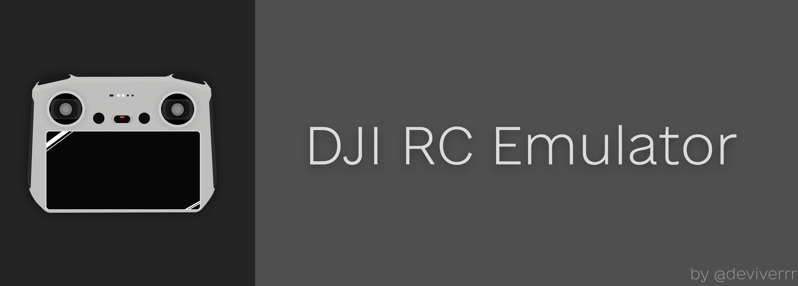
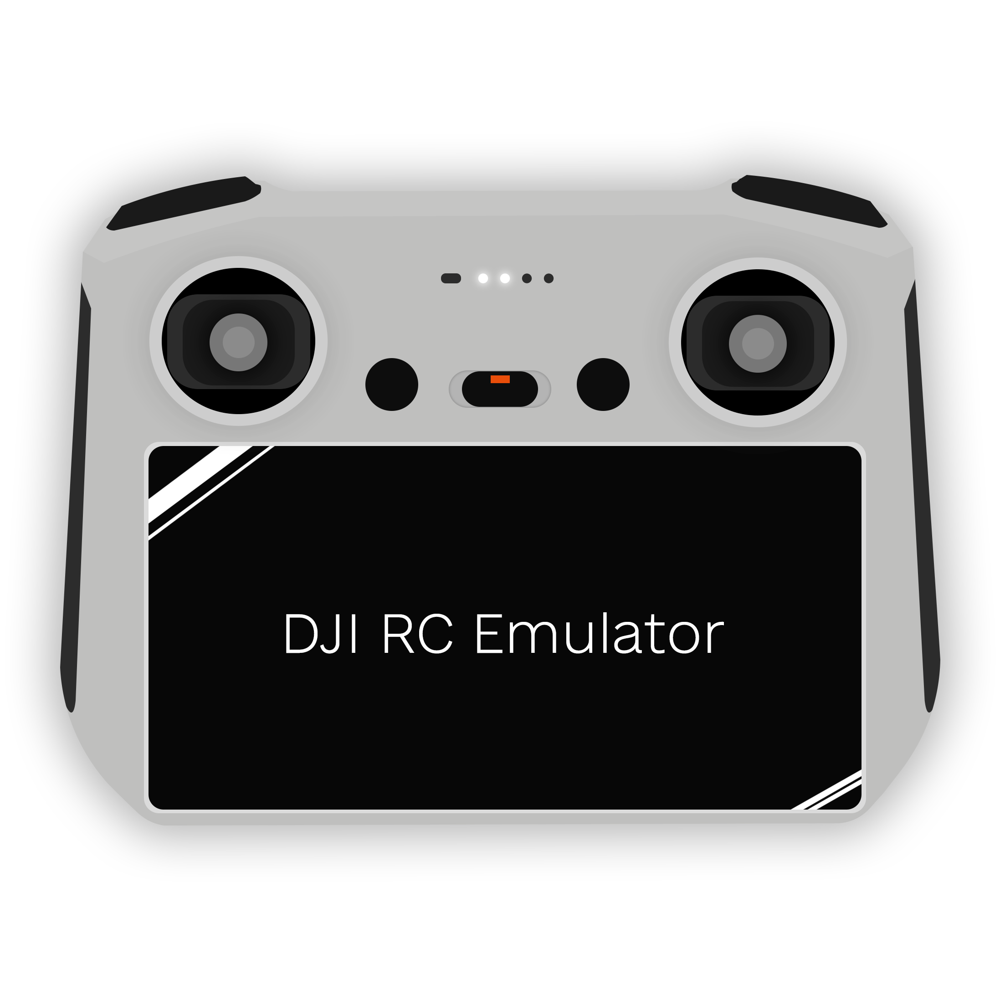
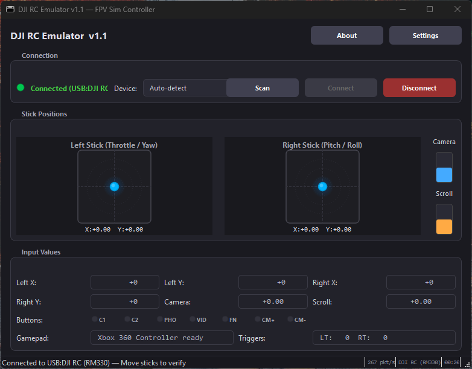

<p align="center">
  
</p>

<h1 align="center">
  
  DJI RC Emulator
</h1>

<p align="center">
  <strong>v1.1</strong> — by <a href="https://deviver.art">deviver</a><br>
  Turns your DJI RC controller into a virtual Xbox 360 gamepad for FPV simulators
</p>

<p align="center">
  <a href="https://ko-fi.com/deviver"></a>
  <a href="https://github.com/deviverr/DJI-RC-Emulator/releases"></a>
  
</p>

---

Use your **DJI RC** (RM330, RC-N1, RC-N2, RC231, etc.) as a virtual **Xbox 360 controller** in **Liftoff**, **VelociDrone**, **DCL**, or any PC game.

The RC connects via **USB-C** and the app reads sticks/buttons over the DJI DUML protocol, then emulates a gamepad via ViGEm.

<p align="center">
  
</p>

---

## Features

- **Live stick visualization** — see both sticks move in real-time
- **6-channel support** — 4 sticks + camera wheel + scroll wheel
- **Button mapping** — C1, C2, Photo, Video, Fn, Scroll mapped to Xbox buttons
- **Expo / Rates curves** — adjustable per-axis
- **Axis remapping** — swap sticks, invert axes, Mode 1/2/3/4 presets
- **Deadzones** — configurable per-axis
- **Auto-reconnect** — handles USB disconnect/reconnect gracefully
- **Low latency** — direct gamepad push from RC callback, no threading overhead
- **Setup wizard** — first-run tutorial with dependency checks
- **Persistent config** — all settings saved to `config.json`

---

## Requirements

1. **Windows 10/11** (ViGEm is Windows-only)
2. **Python 3.10+** — [python.org/downloads](https://www.python.org/downloads/)
3. **ViGEm Bus Driver** — **REQUIRED** for virtual gamepad
   - Download from: [github.com/nefarius/ViGEmBus/releases](https://github.com/nefarius/ViGEmBus/releases)
   - Install `ViGEmBus_Setup_x64.msi`
   - Reboot after install
4. **DJI RC controller** connected via USB-C (bottom port)

---

## Installation

```bash
# 1. Install ViGEm Bus Driver first (see link above)

# 2. Install Python dependencies
pip install -r requirements.txt

# 3. Connect your DJI RC via USB-C

# 4. Run the app
python main.py
# Or double-click start.bat
```

Or use `setup_and_run.bat` for automatic dependency installation on first run.

---

## Usage

1. **Connect your DJI RC** to your PC via the USB-C port on the bottom of the controller
2. **Launch the app** — run `start.bat` or `python main.py`
3. **Click "Connect"** — the app will auto-detect the RC. If not found, select it from the dropdown
4. **Move the sticks** — you should see them move in the visualizer
5. **Open your simulator** (Liftoff, etc.) — configure it to use the Xbox 360 controller
6. **Adjust settings** — click Settings to tune expo, rates, deadzones, and button mapping

---

## Supported Controllers

| Controller | Status |
|-----------|--------|
| DJI RC (RM330) | ✅ Primary target |
| DJI RC-N1 | ✅ Tested |
| DJI RC 231 (Mavic 3) | ✅ Tested |
| DJI RC-N2 | Should work (same protocol) |
| DJI RC 2 | Should work (same protocol) |
| DJI RC Pro | Untested |

---

## Building Executable

```bash
pip install pyinstaller
pyinstaller DJI_RC_Emulator.spec --noconfirm
# Or run build.bat
```

Output: `dist/DJI RC Emulator/DJI RC Emulator.exe`

---

## Troubleshooting

### "ViGEm not available" error
- Install ViGEm Bus Driver from [github.com/nefarius/ViGEmBus/releases](https://github.com/nefarius/ViGEmBus/releases)
- Reboot after installing

### RC not detected
- USB-C must be in the **bottom port** (not top/side)
- Check Device Manager for "DJI USB VCOM" ports
- For RM330/RC2: install WinUSB driver via Zadig when prompted

### Sticks not responding
- Click "Connect" and check for green status
- Disconnect and reconnect if sticks respond slowly

---

## Credits

- Protocol based on [DJI_RC-N1_SIMULATOR_FLY_DCL](https://github.com/) by Ivan Yakymenko
- Virtual gamepad via [ViGEm](https://vigem.org/) and [vgamepad](https://pypi.org/project/vgamepad/)

---

## Support

If you find this useful, consider supporting development:

☕ **[Ko-fi — deviver](https://ko-fi.com/deviver)**

🌐 **[deviver.art](https://deviver.art)**

---

## License

MIT License
